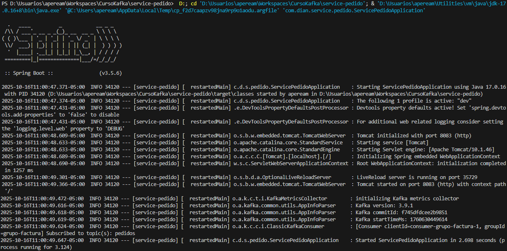
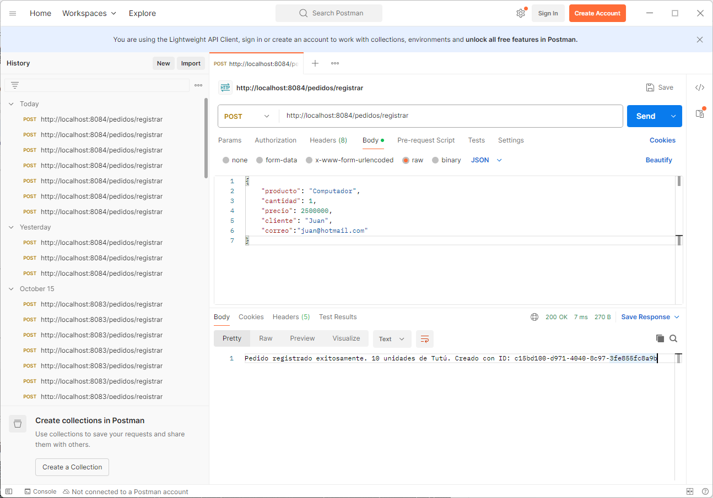
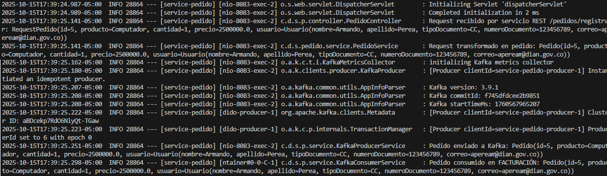

# 🧩 Proyecto Kafka - Productor y Consumidor (Capacitación Universidad Santo Tomás)

## 📘 Necesidad
Este proyecto fue desarrollado como parte de la **capacitación sobre Apache Kafka** dictada en la **Universidad Santo Tomás**.  
El objetivo es **mostrar el funcionamiento de un sistema de mensajería distribuido**, conformado por un **productor de mensajes** y un **consumidor**, ambos implementados en **Spring Boot**.

La práctica busca que los estudiantes comprendan el flujo completo:
- Cómo un microservicio **publica mensajes** en un tópico Kafka.
- Cómo otro microservicio **los consume** y procesa la información.

---

## 🎯 Alcance
El proyecto implementa dos componentes principales bajo la arquitectura Spring Boot:

1. **Productor de pedidos** → Algoritmo productor  
   Envía mensajes con información de pedidos al tópico **`pedidos`** de Kafka.

2. **Consumidor de pedidos** → Algoritmo consumidor  
   Escucha el mismo tópico y registra la información de los pedidos recibidos.

Ambos servicios se comunican mediante un **broker Kafka** desplegado en **Podman** dentro de **WSL2**.

---

## ⚙️ Requerimientos Técnicos

### 🧱 Software necesario
- **Windows 10/11 con WSL2**
- **Podman** y **Podman Compose**
- **Java 17 o superior**
- **Maven 3.9+**
- **Visual Studio Code** (o editor de preferencia)
- **Git** (para clonar o subir al repositorio)

---

### 🐳 Podman Compose

#### Crear Cluster inicial

El cluster inicial consta de un Zookeeper, 3 broker Kafka y la aplicación Kafdrop
Para el caso el archivo se llama `podman-compose-kafka-3brokers.yml` con el siguiente contenido:

```yaml
version: "3.8"

services:
  zookeeper:
    image: docker.io/confluentinc/cp-zookeeper:7.5.0
    container_name: zookeeper
    environment:
      ZOOKEEPER_CLIENT_PORT: 2181
      ZOOKEEPER_TICK_TIME: 2000
    networks:
      - kafka-lab
    ports: ["2181:2181"]
    restart: unless-stopped

  kafka1:
    image: docker.io/confluentinc/cp-kafka:7.5.0
    container_name: kafka1
    hostname: kafka1
    depends_on: [zookeeper]
    ports: ["9092:9092"]
    environment:
      KAFKA_BROKER_ID: 1
      KAFKA_ZOOKEEPER_CONNECT: zookeeper:2181
      KAFKA_LISTENER_SECURITY_PROTOCOL_MAP: INTERNAL:PLAINTEXT,EXTERNAL:PLAINTEXT
      KAFKA_LISTENERS: INTERNAL://0.0.0.0:29092,EXTERNAL://0.0.0.0:9092
      KAFKA_ADVERTISED_LISTENERS: INTERNAL://kafka1:29092,EXTERNAL://172.24.119.148:9092
      KAFKA_INTER_BROKER_LISTENER_NAME: INTERNAL
      KAFKA_OFFSETS_TOPIC_REPLICATION_FACTOR: 3
      KAFKA_TRANSACTION_STATE_LOG_REPLICATION_FACTOR: 3
      KAFKA_TRANSACTION_STATE_LOG_MIN_ISR: 2
      KAFKA_MIN_INSYNC_REPLICAS: 2
      KAFKA_AUTO_CREATE_TOPICS_ENABLE: "false"
    networks:
      - kafka-lab
    restart: unless-stopped

  kafka2:
    image: docker.io/confluentinc/cp-kafka:7.5.0
    container_name: kafka2
    hostname: kafka2
    depends_on: [zookeeper]
    ports: ["9093:9092"]
    environment:
      KAFKA_BROKER_ID: 2
      KAFKA_ZOOKEEPER_CONNECT: zookeeper:2181
      KAFKA_LISTENER_SECURITY_PROTOCOL_MAP: INTERNAL:PLAINTEXT,EXTERNAL:PLAINTEXT
      KAFKA_LISTENERS: INTERNAL://0.0.0.0:29092,EXTERNAL://0.0.0.0:9092
      KAFKA_ADVERTISED_LISTENERS: INTERNAL://kafka2:29092,EXTERNAL://172.24.119.148:9093
      KAFKA_INTER_BROKER_LISTENER_NAME: INTERNAL
      KAFKA_OFFSETS_TOPIC_REPLICATION_FACTOR: 3
      KAFKA_TRANSACTION_STATE_LOG_REPLICATION_FACTOR: 3
      KAFKA_TRANSACTION_STATE_LOG_MIN_ISR: 2
      KAFKA_MIN_INSYNC_REPLICAS: 2
      KAFKA_AUTO_CREATE_TOPICS_ENABLE: "false"
    networks:
      - kafka-lab
    restart: unless-stopped

  kafka3:
    image: docker.io/confluentinc/cp-kafka:7.5.0
    container_name: kafka3
    hostname: kafka3
    depends_on: [zookeeper]
    ports: ["9094:9092"]
    environment:
      KAFKA_BROKER_ID: 3
      KAFKA_ZOOKEEPER_CONNECT: zookeeper:2181
      KAFKA_LISTENER_SECURITY_PROTOCOL_MAP: INTERNAL:PLAINTEXT,EXTERNAL:PLAINTEXT
      KAFKA_LISTENERS: INTERNAL://0.0.0.0:29092,EXTERNAL://0.0.0.0:9092
      KAFKA_ADVERTISED_LISTENERS: INTERNAL://kafka3:29092,EXTERNAL://172.24.119.148:9094
      KAFKA_INTER_BROKER_LISTENER_NAME: INTERNAL
      KAFKA_OFFSETS_TOPIC_REPLICATION_FACTOR: 3
      KAFKA_TRANSACTION_STATE_LOG_REPLICATION_FACTOR: 3
      KAFKA_TRANSACTION_STATE_LOG_MIN_ISR: 2
      KAFKA_MIN_INSYNC_REPLICAS: 2
      KAFKA_AUTO_CREATE_TOPICS_ENABLE: "false"
    networks:
      - kafka-lab
    restart: unless-stopped

  kafdrop:
    image: docker.io/obsidiandynamics/kafdrop:latest
    container_name: kafdrop
    depends_on:
      - kafka1
      - kafka2
      - kafka3
    ports:
      - "9000:9000"
    environment:
      KAFKA_BROKERCONNECT: "kafka1:29092,kafka2:29092,kafka3:29092"
      SERVER_PORT: 9000
      SERVER_SERVLET_CONTEXT_PATH: /
    networks:
      - kafka-lab
    restart: unless-stopped

networks:
  kafka-lab:
    name: kafka-lab
    driver: bridge
    external: false
```
La creación se realiza corriendo el comando podman-compose en WSL

```bash
podman-compose -f podman-compose-kafka-3brokers.yml up -d
```

#### 🧠 Nota:
La IP 172.24.119.148 corresponde a la dirección del entorno WSL.
Se puede obtener con el comando:

```bash
wsl hostname -I
```
y reemplazarla en el YAML y en el código Java donde se configura spring.kafka.bootstrap-servers.

#### Crear Kafka Connect

Los contenedores para Kafka Connect son la base de datos Postgres, la aplicación PgAdmin y el propio Kafka Connect.
Para el caso el archivo se llama `podman-compose-postgres.yml`.

##### Crear archivo de creación de tabla de pedidos
Para crear automáticamente la tabla de pedidos es necesario crear la carpeta initdb/ en el mismo directorio del YAML y dentro el archivo 01_create_pedidos.sql

```sql
CREATE TABLE IF NOT EXISTS pedidos (
    id VARCHAR(100) PRIMARY KEY,
    producto VARCHAR(255) NOT NULL,
    cantidad INT NOT NULL,
    precio DECIMAL(10, 2) NOT NULL,
    total DECIMAL(12, 2) GENERATED ALWAYS AS (cantidad * precio) STORED,
    cliente VARCHAR(255),
    correo VARCHAR(255),
    fecha_creacion TIMESTAMP DEFAULT CURRENT_TIMESTAMP
);
```

Cuando se levante el contenedor por primera vez, Postgres ejecutará automáticamente todos los scripts .sql en ./initdb.
Los scripts solo se ejecutan la primera vez que se inicializa el volumen pgdata.
Si ya existe la base de datos, se debe eliminar el volumen para reejecutarlos:

```bash
podman volume rm pgdata
```

o borrar la carpeta local pgdata/.

##### Archivo de creación de contenedores
El contenido del archivo YAML es el siguiente:

```yaml
version: "3.8"

services:
  postgres:
    image: docker.io/library/postgres:15
    container_name: postgres
    hostname: postgres
    environment:
      POSTGRES_DB: demo
      POSTGRES_USER: demo
      POSTGRES_PASSWORD: demo
    networks:
      - kafka-lab
    ports:
      - "5432:5432"
    volumes:
      - ./pgdata:/var/lib/postgresql/data
      # Agrega esta línea para ejecutar scripts SQL al iniciar el contenedor
      - ./initdb:/docker-entrypoint-initdb.d:ro
    healthcheck:
      test: ["CMD-SHELL", "pg_isready -U $$POSTGRES_USER -d $$POSTGRES_DB"]
      interval: 10s
      timeout: 5s
      retries: 5

  # (Opcional) UI web para administrar Postgres
  pgadmin:
    image: docker.io/dpage/pgadmin4:8.10
    container_name: pgadmin
    hostname: pgadmin
    depends_on:
      - postgres
    environment:
      PGADMIN_DEFAULT_EMAIL: admin@example.com
      PGADMIN_DEFAULT_PASSWORD: admin123
    networks:
      - kafka-lab
    ports:
      - "8081:80"

  connect:
    image: docker.io/confluentinc/cp-kafka-connect:7.5.0
    container_name: connect
    hostname: connect
    user: root
    depends_on:
      - kafka1
      - kafka2
      - kafka3
      - zookeeper
    ports:
      - "8083:8083"
    environment:
      # Bootstrap del clúster (usa los listeners internos para dentro de la red)
      CONNECT_BOOTSTRAP_SERVERS: "kafka1:29092,kafka2:29092,kafka3:29092"
      CONNECT_REST_ADVERTISED_HOST_NAME: "connect"
      CONNECT_REST_PORT: 8083

      # Grupo y tópicos internos de Connect
      CONNECT_GROUP_ID: "connect-cluster"
      CONNECT_CONFIG_STORAGE_TOPIC: "connect-configs"
      CONNECT_OFFSET_STORAGE_TOPIC: "connect-offsets"
      CONNECT_STATUS_STORAGE_TOPIC: "connect-status"
      CONNECT_CONFIG_STORAGE_REPLICATION_FACTOR: 3
      CONNECT_OFFSET_STORAGE_REPLICATION_FACTOR: 3
      CONNECT_STATUS_STORAGE_REPLICATION_FACTOR: 3

      # Convertidores (valor con esquema para JDBC)
      CONNECT_VALUE_CONVERTER_SCHEMAS_ENABLE: "false"
      CONNECT_KEY_CONVERTER: "org.apache.kafka.connect.storage.StringConverter"
      CONNECT_VALUE_CONVERTER: "org.apache.kafka.connect.json.JsonConverter"
      CONNECT_INTERNAL_KEY_CONVERTER: "org.apache.kafka.connect.json.JsonConverter"
      CONNECT_INTERNAL_VALUE_CONVERTER: "org.apache.kafka.connect.json.JsonConverter"

      # Plugins
      CONNECT_PLUGIN_PATH: "/usr/share/java,/usr/share/confluent-hub-components"

      # Logs
      CONNECT_LOG4J_ROOT_LOGLEVEL: "INFO"
      CONNECT_LOG4J_LOGGERS: "org.reflections=ERROR"
    networks:
      - kafka-lab
    # Si quieres montar jars/configs extra, agrega volumes aquí
    volumes:
      - ./plugins:/usr/share/confluent-hub-components
    command:
      - bash
      - -c
      - |
        echo "📁 Creando carpeta de plugins..."
        mkdir -p /usr/share/confluent-hub-components
        echo "🧩 Instalando conector JDBC..."
        confluent-hub install --no-prompt confluentinc/kafka-connect-jdbc:10.7.4
        echo "🚀 Iniciando Kafka Connect..."
        /etc/confluent/docker/run

networks:
  kafka-lab:
    external: true
```

La creación se realiza corriendo el comando podman-compose en WSL
```bash
podman-compose -f podman-compose-postgres.yml up -d
```

Se verifica la existencia de la tabla pedido con la siguiente instrucción
```bash
podman exec -it postgres psql -U demo -d demo -c "\d pedidos"
```
Se verifica la existencia de la tabla pedido con la siguiente instrucción
```bash
podman exec -it postgres psql -U demo -d demo -c "\d pedidos"
```

##### Crear JDBC Sink Connect
Crear el conector con la instrucción siguiente
```bash
curl -X POST http://localhost:8083/connectors \
  -H "Content-Type: application/json" \
  -d '{
    "name": "jdbc-sink-pedidos",
    "config": {
      "connector.class": "io.confluent.connect.jdbc.JdbcSinkConnector",
      "tasks.max": "1",
      "topics": "pedidos",
      "connection.url": "jdbc:postgresql://postgres:5432/demo",
      "connection.user": "demo",
      "connection.password": "demo",
      "auto.create": "false",
      "auto.evolve": "true",
      "insert.mode": "insert",
      "pk.mode": "none",
      "table.name.format": "pedidos",

      "key.converter": "org.apache.kafka.connect.storage.StringConverter",
      "key.converter.schemas.enable": "false",
      "value.converter": "org.apache.kafka.connect.json.JsonConverter",
      "value.converter.schemas.enable": "true"
    }
  }'
  ```
  Cada vez que se crea un pedido se deben esperar al menos 5 minutos para ver reflejado el registro en la base de datos

### ⚙️ Configuración del proyecto
Archivo application.properties (extracto):

```code
spring.application.name=service-pedido
server.port=8084

# Kafka
spring.kafka.bootstrap-servers=172.24.119.148:9092
```
#### 🧠 Nota:
La IP 172.24.119.148 corresponde a la dirección del entorno WSL.

### 🧩 Verificar el Tópico `pedidos`

Antes de ejecutar el programa de este laboratorio, es necesario asegurarse de que el **tópico `pedidos`** exista en el clúster de Kafka.  
Este tópico es el canal de mensajería donde el productor publica los pedidos y el consumidor los procesa.

---

#### 🔍 Verificar la existencia del tópico

En el entorno **WSL**, con los contenedores de Kafka levantados mediante `podman-compose`, ejecutar el siguiente comando dentro del contenedor `kafka1`:

```bash
podman exec -it kafka1 kafka-topics --bootstrap-server localhost:9092 --list
```

Si el tópico no aparece en la lista anterior, créarlo manualmente ejecutando este comando:
#### ⚙️ Crear el tópico pedidos (si no existe)

```bash
podman exec -it kafka1 kafka-topics \
  --bootstrap-server localhost:9092 \
  --create \
  --topic pedidos \
  --partitions 2 \
  --replication-factor 2
```

#### 🔎 3️⃣ Confirmar la creación del tópico

Para validar que se creó correctamente:

```bash
podman exec -it kafka1 kafka-topics \
  --bootstrap-server localhost:29092 \
  --describe \
  --topic pedidos
```

### Verificar la red interna de todos los componentes
Todos los contenedores deberían estar en la red kafka-lab. para comprobarlo correr este comando:
```bash
podman ps --format "{{.Names}}  {{.Networks}}  {{.Status}}"
```
Deben conectar todos a la misma red

### Probar conectividad desde Kafka
```bash
podman exec -it kafka1 bash -lc 'getent hosts postgres || echo NO-RESUELVE'
```


## 🚀 Operación
### Levantar Kafka en Podman
```bash
podman-compose -f podman-compose-kafka-3brokers.yml up -d
```

### Verificar los contenedores:
```bash
podman ps
```

### Ejecutar la aplicación
```bash
./mvnw spring-boot:run -Dspring-boot.run.profiles=pedido
```

### Enviar un pedido de prueba
Se puede usar Postman o curl:
```bash
curl -X POST http://localhost:8083/pedidos \
-H "Content-Type: application/json" \
-d '{
    "producto": "Computador",
    "cantidad": 1,
    "precio": 2500000,
    "cliente": "Juan",
    "correo":"juan@hotmail.com"
}'
```

### Visualizar la recepción en el servicio REST
En el log de la aplicación se verá algo como:
```bash
Request recibido por servicio REST /pedidos/registrar: RequestPedido(id=...
```
### Visualizar la transformación de la entidad recibida en el servicio REST
En el log de la aplicación se verá algo como:
```bash
Request transformado en pedido: Pedido(id=...
```

### Visualizar el envío del Pedido a Kafka
En el log de la aplicación se verá algo como:
```bash
Pedido enviado a Kafka: Pedido(id=...
```

### Visualizar el consumo del Pedido de Kafka
En el log de la aplicación se verá algo como:
```bash
Pedido consumido en FACTURACIÓN: Pedido(id=
```
## 🖼️ Resultado en Imágenes
### Verificación de los contenedores


### Inicialización


### Solicitud desde Postman


### Ejecución


📚 Créditos
Proyecto desarrollado por Armando Perea
Dirección de Impuestos y Aduanas Nacionales (DIAN)
Para la Universidad Santo Tomás — Capacitación Kafka 2025.