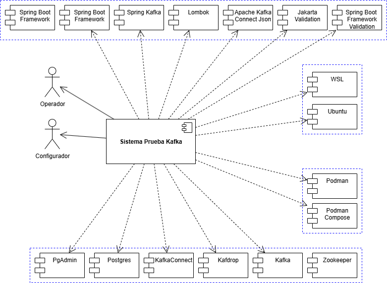
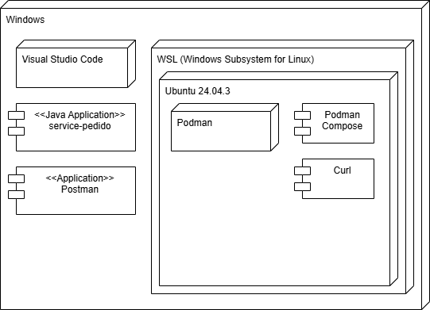
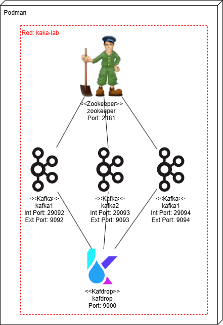
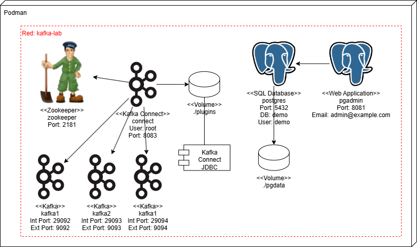

# 🧩 Proyecto Kafka - Productor y Consumidores (Capacitación Universidad Santo Tomás)

## 📘 Necesidad
Este proyecto fue desarrollado como parte de la **capacitación sobre Apache Kafka** dictada en la **Universidad Santo Tomás**.  
El objetivo es **mostrar el funcionamiento de un sistema de mensajería distribuido**, conformado por un **productor de mensajes** y un **consumidor**, ambos implementados en **Spring Boot**. También se muestra el funcionamiento de un **consumidor** KafkaConnect a una base de datos con un connector tipo JDBC Sink.

La práctica busca que los estudiantes comprendan el flujo completo:
- Cómo un microservicio **publica mensajes** en un tópico Kafka.
- Cómo otro microservicio **los consume** y procesa la información.
- Cómo se pueden usar los tópicos para que otros consumidores lo usen
- Cómo Kafka Connect ayuda al traslado de información

---

## 🎯 Alcance
El proyecto implementa dos componentes principales bajo la arquitectura Spring Boot:

1. **Productor de pedidos** → Algoritmo productor  
   Envía mensajes con información de pedidos al tópico **`pedidos`** de Kafka.

2. **Consumidor de pedidos** → Algoritmo consumidor  
   Escucha el mismo tópico y registra la información de los pedidos recibidos.

Ambos servicios se comunican mediante un **broker Kafka** desplegado en **Podman** dentro de **WSL2**.

También se implementa un conector Kafka Connect de tipo JDBC Sink:

**Consumidor de pedidos** Conector consumidor
   Escucha el mismo tópico y registra la información de los pedidos recibidos en una base de datos Postgres.

---

## ⚙️ Requerimientos Técnicos

### 🧱 Software necesario
- **Windows 10/11 con WSL2**
- **Podman** y **Podman Compose**
- **Java 17 o superior**
- **Visual Studio Code** (o editor de preferencia)
- **Git** (para clonar o subir al repositorio)

---

### 🧩 Modelo de Contexto

 
El Modelo de Contexto muestra la interacción del “Sistema Prueba Kafka” con sus actores externos y componentes tecnológicos de soporte, estableciendo sus principales dependencias funcionales y entorno de ejecución.

1. Actores Externos

Configurador: Usuario encargado de parametrizar y ajustar los entornos, definir los tópicos, esquemas y conectores, así como configurar las dependencias del sistema.
Participa en la preparación y mantenimiento técnico del entorno.

Operador: Usuario responsable de ejecutar las pruebas, monitorear la operación de los componentes Kafka y validar el flujo de datos entre los productores y consumidores.
Interactúa directamente con el sistema para supervisar los procesos y resultados.

2. Sistema Principal

Sistema Prueba Kafka: Representa el núcleo del entorno de pruebas e integración.
Este sistema orquesta la comunicación entre aplicaciones Java desarrolladas con Spring Boot y los servicios desplegados sobre Podman y WSL, utilizando Apache Kafka como bus de mensajería y PostgreSQL como base de datos de respaldo.

3. Dependencias Lógicas (Bibliotecas y Frameworks)

Estas dependencias corresponden a los componentes internos del sistema, usados en la implementación de las aplicaciones de prueba:

Spring Boot Framework: Proporciona la estructura principal para las aplicaciones Java.

Spring Kafka: Facilita la integración entre Spring Boot y Apache Kafka.

Lombok: Simplifica el código fuente reduciendo la escritura de métodos repetitivos.

Apache Kafka Connect JSON: Permite la conexión de flujos de datos JSON entre Kafka y sistemas externos.

Jakarta Validation y Spring Boot Validation: Gestionan la validación de datos de entrada y salida.

Estas bibliotecas definen la capa lógica de desarrollo utilizada por el sistema.

4. Entorno de Ejecución (Infraestructura de Prueba)

Organizado en tres bloques principales:

🔹 Entorno de virtualización

WSL (Windows Subsystem for Linux): Proporciona el entorno base Linux para ejecución.

Ubuntu: Distribución utilizada dentro de WSL para desplegar los servicios.

🔹 Contenedores y orquestación

Podman: Motor de contenedores que permite la ejecución aislada de servicios.

Podman Compose: Herramienta para orquestar múltiples contenedores de forma coordinada.

🔹 Servicios desplegados

PgAdmin: Cliente de administración de bases de datos PostgreSQL.

Postgres: Base de datos relacional utilizada por los conectores Kafka.

KafkaConnect: Permite integrar Kafka con fuentes y destinos externos.

Kafdrop: Interfaz web para visualizar tópicos y mensajes en Kafka.

Kafka: Sistema central de mensajería distribuida.

Zookeeper: Servicio auxiliar que coordina y gestiona la configuración de Kafka.

5. Relaciones Principales

El Sistema Prueba Kafka actúa como nodo central:

Consume las librerías de desarrollo (dependencias internas).

Se comunica con el entorno de ejecución (WSL, Podman, Ubuntu).

Interactúa con los servicios desplegados (Kafka, Zookeeper, PostgreSQL, etc.).

Permite la interacción de usuarios (Operador y Configurador).

---

## 🐳 Configuración - Ambiente Inicial

En el entorno de requerido inicialmente se distribuyen los componentes de software entre los distintos ambientes y herramientas dentro de un entorno de desarrollo híbrido Windows–Linux (WSL).



### 🧩 Descripción general del modelo

El modelo muestra un entorno de desarrollo en Windows, donde conviven herramientas nativas de Windows con un subsistema Linux (WSL) que ejecuta servicios y utilidades en un entorno Ubuntu 24.04.3.
Las cajas grandes representan ambientes o plataformas de ejecución, y dentro de ellas se encuentran los componentes o aplicaciones desplegadas.

🖥️ Entorno principal: Windows

Windows actúa como el sistema operativo anfitrión, proporcionando las herramientas gráficas y de desarrollo:

- Visual Studio Code: Entorno de desarrollo integrado (IDE) usado para editar, compilar y ejecutar la aplicación Java. Se conecta al entorno Linux (WSL) para ejecutar servicios y comandos dentro de Ubuntu.

- service-pedido: Aplicación desarrollada en Java (Spring Boot), que se ejecuta o se depura desde VS Code. Se comunica con servicios o contenedores alojados en el entorno WSL.

- Postman: Herramienta de prueba de APIs REST. Se usa desde Windows para enviar solicitudes HTTP hacia los endpoints expuestos por la aplicación service-pedido o por servicios desplegados dentro de WSL.

🐧 Entorno secundario: WSL (Windows Subsystem for Linux)

WSL actúa como un entorno Linux embebido dentro de Windows, permitiendo ejecutar utilidades y contenedores sin necesidad de una máquina virtual completa.

🔹 Ubuntu 24.04.3

Distribución Linux que aloja las herramientas de despliegue y prueba.

Dentro de ella se encuentran:

- Podman: Motor de contenedores compatible con Docker. Se usa para ejecutar servicios en contenedores (por ejemplo, Kafka, PostgreSQL u otros microservicios).

- Podman Compose: Herramienta complementaria que permite orquestar múltiples contenedores mediante archivos podman-compose.yml, similar a Docker Compose.

- Curl: Utilidad de línea de comandos para realizar peticiones HTTP y probar conectividad entre servicios (por ejemplo, validar endpoints o puertos abiertos en los contenedores).

## 🧠 Configuración - Red entre Windows y WSL

Los motivos por los cuáles se debe determinar la IP de la máquina WSL son los siguientes:

1. Aislamiento de red entre Windows y WSL2

   WSL2 corre dentro de una máquina virtual ligera con su propia pila de red (NAT).

   Esto significa que localhost en Windows no es el mismo localhost dentro de WSL.

   Por tanto, cuando un servicio (por ejemplo, Kafka o PostgreSQL) corre dentro de WSL o un contenedor Podman en WSL, solo es accesible desde la IP asignada a la VM de WSL, no desde 127.0.0.1 en Windows.

2. Comunicación cruzada entre entornos

   Al ejecutar una aplicación Java desde Windows (o VSCode en modo Windows), y los servicios backend (Kafka, PostgreSQL, etc.) desde WSL o Podman, la comunicación debe realizarse usando la dirección IP de la interfaz de WSL (por ejemplo, 172.24.119.148).

   Esto garantiza que la aplicación se conecte al endpoint correcto a través de la red virtual que enlaza Windows ↔ WSL.

3. Resolución correcta de nombres de host

   En muchos casos, el nombre localhost se resuelve internamente dentro del entorno local (Windows o WSL), lo que causa fallos de conexión si los servicios están en el otro lado.

   Usar la IP explícita evita ambigüedades de resolución DNS o rutas NAT invertidas.

4. Compatibilidad con herramientas de contenedores (Podman/Docker)

   Podman y Docker crean redes internas (bridges) para sus contenedores.

   Si el contenedor expone un puerto (por ejemplo 9092 para Kafka), ese puerto solo es accesible fuera del contenedor a través de la IP del host WSL, no mediante localhost desde Windows.

   Documentar la IP permite reproducir la configuración correctamente en otros entornos o equipos.

5. Diagnóstico y trazabilidad

   Registrar la IP de la máquina WSL permite:

   Validar conectividad (ping, curl, telnet).

   Asegurar que las configuraciones (*.yaml) están apuntando al entorno correcto.
   
   Evitar conflictos de red o bloqueos de firewall corporativo que pueden afectar a localhost.

6. Persistencia y cambio de IP

   La IP de WSL puede cambiar tras reinicios.

   Por eso conviene documentar el método de obtención


La IP del entorno WSL se puede obtener corriendo en cmd o PowerShell en Windows el comando:

```bash
wsl hostname -I
```

## 🐳 Configuración - Crear Cluster inicial

El cluster inicial consta de un Zookeeper, 3 broker Kafka y la aplicación Kafdrop.

Para el caso el archivo se llama `podman-compose-kafka-3brokers.yml` con el siguiente contenido (OJO, reemplazar dirección IP de WSL):

```yaml
version: "3.8"

services:
  zookeeper:
    image: docker.io/confluentinc/cp-zookeeper:7.5.0
    container_name: zookeeper
    environment:
      ZOOKEEPER_CLIENT_PORT: 2181
      ZOOKEEPER_TICK_TIME: 2000
    networks:
      - kafka-lab
    ports: ["2181:2181"]
    restart: unless-stopped

  kafka1:
    image: docker.io/confluentinc/cp-kafka:7.5.0
    container_name: kafka1
    hostname: kafka1
    depends_on: [zookeeper]
    ports: ["9092:9092"]
    environment:
      KAFKA_BROKER_ID: 1
      KAFKA_ZOOKEEPER_CONNECT: zookeeper:2181
      KAFKA_LISTENER_SECURITY_PROTOCOL_MAP: INTERNAL:PLAINTEXT,EXTERNAL:PLAINTEXT
      KAFKA_LISTENERS: INTERNAL://0.0.0.0:29092,EXTERNAL://0.0.0.0:9092
      KAFKA_ADVERTISED_LISTENERS: INTERNAL://kafka1:29092,EXTERNAL://172.24.119.148:9092
      KAFKA_INTER_BROKER_LISTENER_NAME: INTERNAL
      KAFKA_OFFSETS_TOPIC_REPLICATION_FACTOR: 3
      KAFKA_TRANSACTION_STATE_LOG_REPLICATION_FACTOR: 3
      KAFKA_TRANSACTION_STATE_LOG_MIN_ISR: 2
      KAFKA_MIN_INSYNC_REPLICAS: 2
      KAFKA_AUTO_CREATE_TOPICS_ENABLE: "false"
    networks:
      - kafka-lab
    restart: unless-stopped

  kafka2:
    image: docker.io/confluentinc/cp-kafka:7.5.0
    container_name: kafka2
    hostname: kafka2
    depends_on: [zookeeper]
    ports: ["9093:9092"]
    environment:
      KAFKA_BROKER_ID: 2
      KAFKA_ZOOKEEPER_CONNECT: zookeeper:2181
      KAFKA_LISTENER_SECURITY_PROTOCOL_MAP: INTERNAL:PLAINTEXT,EXTERNAL:PLAINTEXT
      KAFKA_LISTENERS: INTERNAL://0.0.0.0:29092,EXTERNAL://0.0.0.0:9092
      KAFKA_ADVERTISED_LISTENERS: INTERNAL://kafka2:29092,EXTERNAL://172.24.119.148:9093
      KAFKA_INTER_BROKER_LISTENER_NAME: INTERNAL
      KAFKA_OFFSETS_TOPIC_REPLICATION_FACTOR: 3
      KAFKA_TRANSACTION_STATE_LOG_REPLICATION_FACTOR: 3
      KAFKA_TRANSACTION_STATE_LOG_MIN_ISR: 2
      KAFKA_MIN_INSYNC_REPLICAS: 2
      KAFKA_AUTO_CREATE_TOPICS_ENABLE: "false"
    networks:
      - kafka-lab
    restart: unless-stopped

  kafka3:
    image: docker.io/confluentinc/cp-kafka:7.5.0
    container_name: kafka3
    hostname: kafka3
    depends_on: [zookeeper]
    ports: ["9094:9092"]
    environment:
      KAFKA_BROKER_ID: 3
      KAFKA_ZOOKEEPER_CONNECT: zookeeper:2181
      KAFKA_LISTENER_SECURITY_PROTOCOL_MAP: INTERNAL:PLAINTEXT,EXTERNAL:PLAINTEXT
      KAFKA_LISTENERS: INTERNAL://0.0.0.0:29092,EXTERNAL://0.0.0.0:9092
      KAFKA_ADVERTISED_LISTENERS: INTERNAL://kafka3:29092,EXTERNAL://172.24.119.148:9094
      KAFKA_INTER_BROKER_LISTENER_NAME: INTERNAL
      KAFKA_OFFSETS_TOPIC_REPLICATION_FACTOR: 3
      KAFKA_TRANSACTION_STATE_LOG_REPLICATION_FACTOR: 3
      KAFKA_TRANSACTION_STATE_LOG_MIN_ISR: 2
      KAFKA_MIN_INSYNC_REPLICAS: 2
      KAFKA_AUTO_CREATE_TOPICS_ENABLE: "false"
    networks:
      - kafka-lab
    restart: unless-stopped

  kafdrop:
    image: docker.io/obsidiandynamics/kafdrop:latest
    container_name: kafdrop
    depends_on:
      - kafka1
      - kafka2
      - kafka3
    ports:
      - "9000:9000"
    environment:
      KAFKA_BROKERCONNECT: "kafka1:29092,kafka2:29092,kafka3:29092"
      SERVER_PORT: 9000
      SERVER_SERVLET_CONTEXT_PATH: /
    networks:
      - kafka-lab
    restart: unless-stopped

networks:
  kafka-lab:
    name: kafka-lab
    driver: bridge
    external: false
```
El comando bash a usar dentro de WSL es el siguiente:

```bash
podman-compose -f podman-compose-kafka-3brokers.yml up -d
```

Este comando despliega la siguiente infraestructura en WSL:



Para comprobar que la estructura se desplegó correctamente se ejecuta el comando:

```bash
podman ps --format "table {{.Names}}\t{{.Status}}\t{{.Networks}}\t{{.Ports}}"
```

Se debe desplegar un listado similar a:
```nginx
NAMES       STATUS                  NETWORKS    PORTS
zookeeper   Up 13 minutes           kafka-lab   0.0.0.0:2181->2181/tcp
kafka1      Up 12 minutes           kafka-lab   0.0.0.0:9092->9092/tcp
kafka2      Up 13 minutes           kafka-lab   0.0.0.0:9093->9092/tcp
kafka3      Up 13 minutes           kafka-lab   0.0.0.0:9094->9092/tcp
kafdrop     Up 13 minutes           kafka-lab   0.0.0.0:9000->9000/tcp
```

Donde el listado de los contenedores son los mostrados, todos deben estar con estado Up y los puertos correctamente asignados

---

## 🧩 Configuración - Verificar la existencia del Tópico `pedidos`

Antes de ejecutar el programa de este laboratorio, es necesario asegurarse de que el **tópico `pedidos`** exista en el clúster de Kafka.  
Este tópico es el canal de mensajería donde el productor publica los pedidos y el consumidor los procesa.

Ejecutar el siguiente comando dentro del contenedor `kafka1`:

```bash
podman exec -it kafka1 kafka-topics --bootstrap-server localhost:9092 --list
```

Si el tópico no aparece en la lista anterior, créarlo manualmente (o en Kafdrop) ejecutando este comando:

```bash
podman exec -it kafka1 kafka-topics \
  --bootstrap-server localhost:9092 \
  --create \
  --topic pedidos \
  --partitions 2 \
  --replication-factor 2
```

Para validar que se creó correctamente:

```bash
podman exec -it kafka1 kafka-topics \
  --bootstrap-server localhost:29092 \
  --describe \
  --topic pedidos
```


## 📋 Configuración - Crear Archivo de Creación de Tabla de Pedidos

Para crear automáticamente la tabla de pedidos es necesario crear la carpeta initdb/ en el mismo directorio del YAML y dentro el archivo 01_create_pedidos.sql

```sql
CREATE TABLE IF NOT EXISTS pedidos (
    id VARCHAR(100) PRIMARY KEY,
    producto VARCHAR(255) NOT NULL,
    cantidad INT NOT NULL,
    precio DECIMAL(10, 2) NOT NULL,
    total DECIMAL(12, 2) GENERATED ALWAYS AS (cantidad * precio) STORED,
    cliente VARCHAR(255),
    correo VARCHAR(255),
    fecha_creacion TIMESTAMP DEFAULT CURRENT_TIMESTAMP
);
```

Cuando se cree el contenedor por primera vez, Postgres ejecutará automáticamente todos los scripts .sql en ./initdb.
Los scripts solo se ejecutan la primera vez que se inicializa el volumen pgdata.
Si ya existe la base de datos, se debe eliminar el volumen para reejecutarlos:

```bash
podman volume rm pgdata
```

o borrar la carpeta local pgdata/.

## 🐳 Configuración - Crear Infraestructura Kafka Connect

Los contenedores para Kafka Connect son la base de datos Postgres, la aplicación PgAdmin y el propio Kafka Connect.
Para el caso el archivo se llama `podman-compose-postgres.yml`.

El contenido del archivo YAML es el siguiente (OJO, reemplazar dirección IP de WSL):

```yaml
version: "3.8"

services:
  postgres:
    image: docker.io/library/postgres:15
    container_name: postgres
    hostname: postgres
    environment:
      POSTGRES_DB: demo
      POSTGRES_USER: demo
      POSTGRES_PASSWORD: demo
    networks:
      - kafka-lab
    ports:
      - "5432:5432"
    volumes:
      - ./pgdata:/var/lib/postgresql/data
      # Agrega esta línea para ejecutar scripts SQL al iniciar el contenedor
      - ./initdb:/docker-entrypoint-initdb.d:ro
    healthcheck:
      test: ["CMD-SHELL", "pg_isready -U $$POSTGRES_USER -d $$POSTGRES_DB"]
      interval: 10s
      timeout: 5s
      retries: 5

  # (Opcional) UI web para administrar Postgres
  pgadmin:
    image: docker.io/dpage/pgadmin4:8.10
    container_name: pgadmin
    hostname: pgadmin
    depends_on:
      - postgres
    environment:
      PGADMIN_DEFAULT_EMAIL: admin@example.com
      PGADMIN_DEFAULT_PASSWORD: admin123
    networks:
      - kafka-lab
    ports:
      - "8081:80"

  connect:
    image: docker.io/confluentinc/cp-kafka-connect:7.5.0
    container_name: connect
    hostname: connect
    user: root
    depends_on:
      - kafka1
      - kafka2
      - kafka3
      - zookeeper
    ports:
      - "8083:8083"
    environment:
      # Bootstrap del clúster (usa los listeners internos para dentro de la red)
      CONNECT_BOOTSTRAP_SERVERS: "kafka1:29092,kafka2:29092,kafka3:29092"
      CONNECT_REST_ADVERTISED_HOST_NAME: "connect"
      CONNECT_REST_PORT: 8083

      # Grupo y tópicos internos de Connect
      CONNECT_GROUP_ID: "connect-cluster"
      CONNECT_CONFIG_STORAGE_TOPIC: "connect-configs"
      CONNECT_OFFSET_STORAGE_TOPIC: "connect-offsets"
      CONNECT_STATUS_STORAGE_TOPIC: "connect-status"
      CONNECT_CONFIG_STORAGE_REPLICATION_FACTOR: 3
      CONNECT_OFFSET_STORAGE_REPLICATION_FACTOR: 3
      CONNECT_STATUS_STORAGE_REPLICATION_FACTOR: 3

      # Convertidores (valor con esquema para JDBC)
      CONNECT_VALUE_CONVERTER_SCHEMAS_ENABLE: "false"
      CONNECT_KEY_CONVERTER: "org.apache.kafka.connect.storage.StringConverter"
      CONNECT_VALUE_CONVERTER: "org.apache.kafka.connect.json.JsonConverter"
      CONNECT_INTERNAL_KEY_CONVERTER: "org.apache.kafka.connect.json.JsonConverter"
      CONNECT_INTERNAL_VALUE_CONVERTER: "org.apache.kafka.connect.json.JsonConverter"

      # Plugins
      CONNECT_PLUGIN_PATH: "/usr/share/java,/usr/share/confluent-hub-components"

      # Logs
      CONNECT_LOG4J_ROOT_LOGLEVEL: "INFO"
      CONNECT_LOG4J_LOGGERS: "org.reflections=ERROR"
    networks:
      - kafka-lab
    # Si quieres montar jars/configs extra, agrega volumes aquí
    volumes:
      - ./plugins:/usr/share/confluent-hub-components
    command:
      - bash
      - -c
      - |
        echo "📁 Creando carpeta de plugins..."
        mkdir -p /usr/share/confluent-hub-components
        echo "🧩 Instalando conector JDBC..."
        confluent-hub install --no-prompt confluentinc/kafka-connect-jdbc:10.7.4
        echo "🚀 Iniciando Kafka Connect..."
        /etc/confluent/docker/run

networks:
  kafka-lab:
    external: true
```

La creación se realiza corriendo el comando podman-compose en WSL
```bash
podman-compose -f podman-compose-postgres.yml up -d
```

Este comando despliega la siguiente infraestructura en WSL:



```bash
podman ps --format "table {{.Names}}\t{{.Status}}\t{{.Networks}}\t{{.Ports}}"
```

Se debe desplegar un listado similar a:
```nginx
NAMES       STATUS                  NETWORKS    PORTS
zookeeper   Up 13 minutes           kafka-lab   0.0.0.0:2181->2181/tcp
kafka1      Up 12 minutes           kafka-lab   0.0.0.0:9092->9092/tcp
kafka2      Up 13 minutes           kafka-lab   0.0.0.0:9093->9092/tcp
kafka3      Up 13 minutes           kafka-lab   0.0.0.0:9094->9092/tcp
kafdrop     Up 13 minutes           kafka-lab   0.0.0.0:9000->9000/tcp
postgres    Up 6 minutes (healthy)  kafka-lab   0.0.0.0:5432->5432/tcp
pgadmin     Up 6 minutes            kafka-lab   0.0.0.0:8081->80/tcp
connect     Up 6 minutes (healthy)  kafka-lab   0.0.0.0:8083->8083/tcp
```

Donde el listado de los contenedores son los mostrados, todos deben estar con estado Up y los puertos correctamente asignados

Se verifica la correcta operación del servidor Kafka Connect inspeccionando que el log no contenga errores con el comando:

```bash
podman logs connect
```
Se verifica que el Kafka Connect tenga instalado el plugin JDBC con el comando:

```bash
 curl http://localhost:8083/connector-plugins
```
Entre los plugins debría aparecer listado `io.confluent.connect.jdbc.JdbcSinkConnector` y `io.confluent.connect.jdbc.JdbcSourceConnector`

Se verifica la existencia de la tabla pedido con la siguiente instrucción
```bash
podman exec -it postgres psql -U demo -d demo -c "\d pedidos"
```

Que debe desplegar desplegar la descripción de la tabla así:
```nginx
                                                     Table "public.pedidos"
     Column     |            Type             | Collation | Nullable |                          Default

----------------+-----------------------------+-----------+----------+-----------------------------------------------------------
 id             | character varying(100)      |           | not null |
 producto       | character varying(255)      |           | not null |
 cantidad       | integer                     |           | not null |
 precio         | numeric(10,2)               |           | not null |
 total          | numeric(12,2)               |           |          | generated always as ((cantidad::numeric * precio)) stored
 cliente        | character varying(255)      |           |          |
 correo         | character varying(255)      |           |          |
 fecha_creacion | timestamp without time zone |           |          | CURRENT_TIMESTAMP
Indexes:
    "pedidos_pkey" PRIMARY KEY, btree (id)
```
---

## 🐳 Configuración - Crear JDBC Sink Connect
Verificar que el connector `jdbc-sink-pedidos` no existe. El siguiente comando no debe retornar nada:

```bash
curl http://localhost:8083/connectors
```

Si existe se puede borrar con el siguiente comando

```bash
curl -X DELETE http://localhost:8083/connectors/jdbc-sink-pedidos
```

Crear el conector con la instrucción siguiente
```bash
curl -X POST http://localhost:8083/connectors \
  -H "Content-Type: application/json" \
  -d '{
    "name": "jdbc-sink-pedidos",
    "config": {
      "connector.class": "io.confluent.connect.jdbc.JdbcSinkConnector",
      "tasks.max": "1",
      "topics": "pedidos",
      "connection.url": "jdbc:postgresql://postgres:5432/demo",
      "connection.user": "demo",
      "connection.password": "demo",
      "auto.create": "false",
      "auto.evolve": "true",
      "insert.mode": "insert",
      "pk.mode": "none",
      "table.name.format": "pedidos",

      "key.converter": "org.apache.kafka.connect.storage.StringConverter",
      "key.converter.schemas.enable": "false",
      "value.converter": "org.apache.kafka.connect.json.JsonConverter",
      "value.converter.schemas.enable": "true"
    }
  }'
  ```
  Cada vez que se crea un pedido se deben esperar al menos 5 minutos para ver reflejado el registro en la base de datos

Para ver su estado 
```bash
curl http://localhost:8083/connectors/jdbc-sink-pedidos/status
```

Su estado debe ser `RUNNING`

## ⚙️ Configuración del proyecto
Archivo application.properties (extracto):

```code
spring.application.name=service-pedido
server.port=8084

# Kafka
spring.kafka.bootstrap-servers=172.24.119.148:9092
```
#### 🧠 Nota:
La IP 172.24.119.148 corresponde a la dirección del entorno WSL.

### Verificar la red interna de todos los componentes
Todos los contenedores deberían estar en la red kafka-lab. para comprobarlo correr este comando:
```bash
podman ps --format "{{.Names}}  {{.Networks}}  {{.Status}}"
```
Deben conectar todos a la misma red

### Probar conectividad desde Kafka
```bash
podman exec -it kafka1 bash -lc 'getent hosts postgres || echo NO-RESUELVE'
```


## 🚀 Operación
### Levantar Kafka en Podman
```bash
podman-compose -f podman-compose-kafka-3brokers.yml up -d
```

### Verificar los contenedores:
```bash
podman ps
```

### Ejecutar la aplicación
```bash
./mvnw spring-boot:run -Dspring-boot.run.profiles=pedido
```

### Enviar un pedido de prueba
Se puede usar Postman o curl:
```bash
curl -X POST http://localhost:8083/pedidos \
-H "Content-Type: application/json" \
-d '{
    "producto": "Computador",
    "cantidad": 1,
    "precio": 2500000,
    "cliente": "Juan",
    "correo":"juan@hotmail.com"
}'
```

### Visualizar la recepción en el servicio REST
En el log de la aplicación se verá algo como:
```bash
Request recibido por servicio REST /pedidos/registrar: RequestPedido(id=...
```
### Visualizar la transformación de la entidad recibida en el servicio REST
En el log de la aplicación se verá algo como:
```bash
Request transformado en pedido: Pedido(id=...
```

### Visualizar el envío del Pedido a Kafka
En el log de la aplicación se verá algo como:
```bash
Pedido enviado a Kafka: Pedido(id=...
```

### Visualizar el consumo del Pedido de Kafka
En el log de la aplicación se verá algo como:
```bash
Pedido consumido en FACTURACIÓN: Pedido(id=
```
## 🖼️ Resultado en Imágenes
### Verificación de los contenedores


### Inicialización


### Solicitud desde Postman


### Ejecución


📚 Créditos
Proyecto desarrollado por Armando Perea
Dirección de Impuestos y Aduanas Nacionales (DIAN)
Para la Universidad Santo Tomás — Capacitación Kafka 2025.